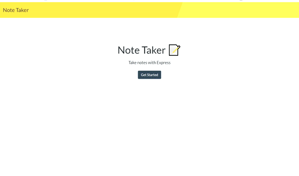

# Node-Taker

    ![Framework]

## General Information
 
* [Deployed Web Application](https://note-takeer.herokuapp.com/)
* [GitHub repository of Note-Taker](https://github.com/ZahraMertens/Node-Taker)

## Table of Contents
1. [General Information](#general-information)
2. [Task Description](#task-description)
3. [Installation Instructions](#installation-instructions)
5. [Technologies Used](#technologies-used)
6. [User Story](#user-story)
7. [Actual Behaviour](#actual-behaviour)
8. [Bonus](#bonus)
9. [Mock-Up](#mock-up)
10. [Credits](#credits)

## Task Description

The Application "Note Taker" is used to write and save notes powered by express.js to save and retrieve the note data from a JSON file database. The major task to connect front-end and back-end and deploy the application on heroku.
The back-end code is the build server with express and to conect the server with middleware, the front-end application and the database.

## Installation Instructions

* 1️⃣ First the user must clone the [GitHub Repo](https://github.com/ZahraMertens/Node-Taker.git) on its computer.

* 2️⃣ Open the repository on your device with VS Code (or any other program)

* 3️⃣ Open the command line at the folder location OR the integrated terminal 

* 4️⃣ First, you MUST install the npm packages by running "npm install" in the terminal

* 5️⃣ To un the application on your local device the user must run "npm start" in the terminal and will see a link such as "http://localhost:8080" if the user runs the link in the browser the application should run on the local host.

* 6️⃣ To deploy the webpage the user must login heroku in the terminal and push the application to heroku. 
   * [To see how to deploy with Git to heroku follow the link](https://devcenter.heroku.com/articles/git)
   * When deployed to heroku the user can go to the repository and find a button in the top right corner to open the app

## Technologies Used

* JavaScript

* Node.JS & Express.JS

* Npm packages: Express, nodeman, util, uuid

* FS (File System)

* CSS & Bootstrap Framework

## User Story

AS A small business owner I WANT to be able to write and save notes SO THAT I can organize my thoughts and keep track of tasks I need to complete

## Actual Behaviour

* WHEN I open the Note Taker THEN I am presented with a landing page with a link to a notes page

* WHEN I click on the link to the notes page THEN I am presented with a page with existing notes listed in the left-hand column, plus empty fields to enter a new note title and the note’s text in the right-hand column

* WHEN I enter a new note title and the note’s text
THEN a Save icon appears in the navigation at the top of the page

* WHEN I click on the Save icon THEN the new note I have entered is saved and appears in the left-hand column with the other existing notes

* WHEN I click on an existing note in the list in the left-hand column THEN that note appears in the right-hand column

* WHEN I click on the Write icon in the navigation at the top of the page THEN I am presented with empty fields to enter a new note title and the note’s text in the right-hand column

## Bonus

* 🏆 WHEN I press the 🗑️-Button then the note is deleted from the webpage and the database

## Mock-Up

🎥 The GIF shows the Landing page and the note page where the user is able to save and delete notes:

## Credits

* https://ezgif.com/crop/ezgif-3-e35ddab000ce.gif
* https://github.com/tchapi/markdown-cheatsheet/blob/master/README.md
* https://devcenter.heroku.com/articles/git
* https://www.youtube.com/watch?v=L72fhGm1tfE&t=811s
* https://openclassrooms.com/en/courses/5614116-go-full-stack-with-node-js-express-and-mongodb/5656256-complete-the-crud-with-update-and-delete
* https://channel9.msdn.com/Series/Beginners-Series-to-NodeJS/How-to-create-update-and-delete-APIs-with-Nodejs-and-Express-21-of-26

© 2021 Zahra Mertens, Note-Taker